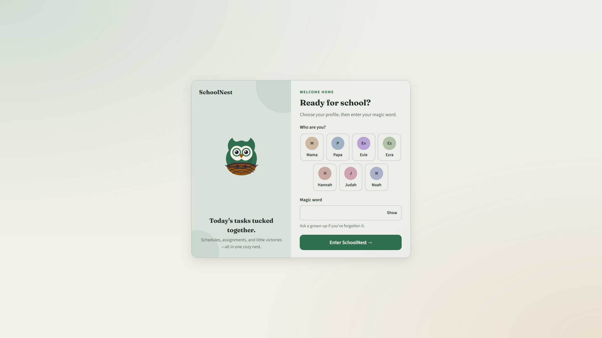
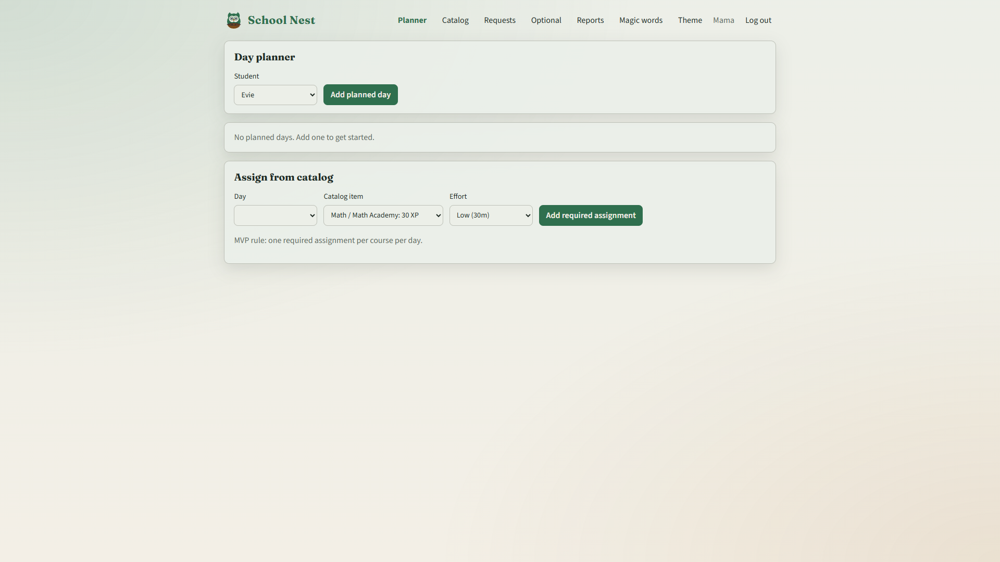
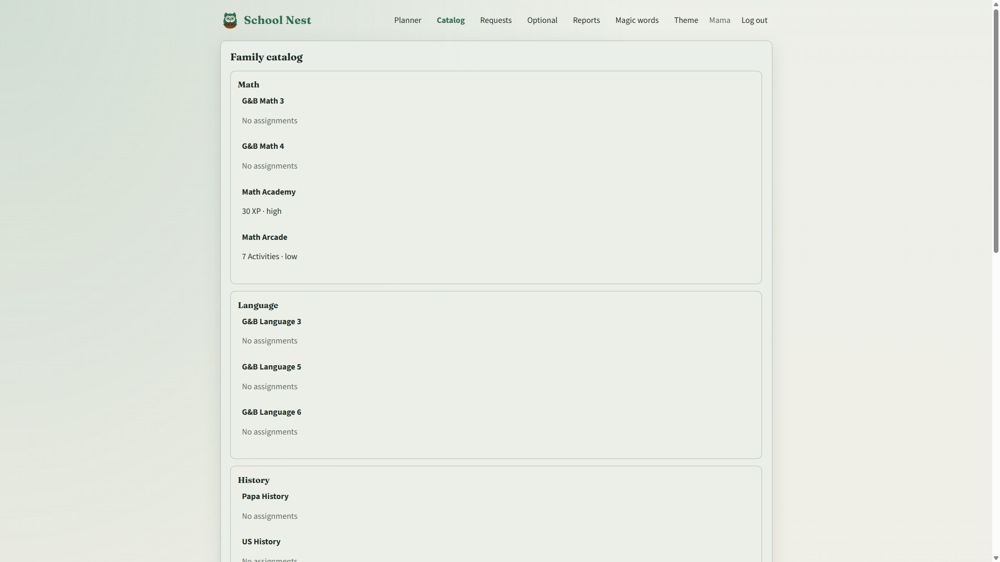
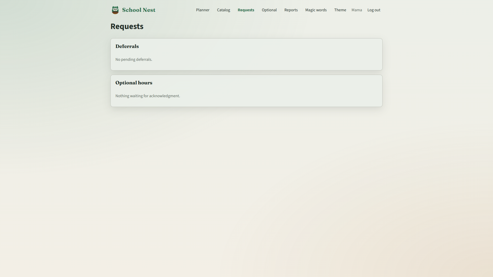
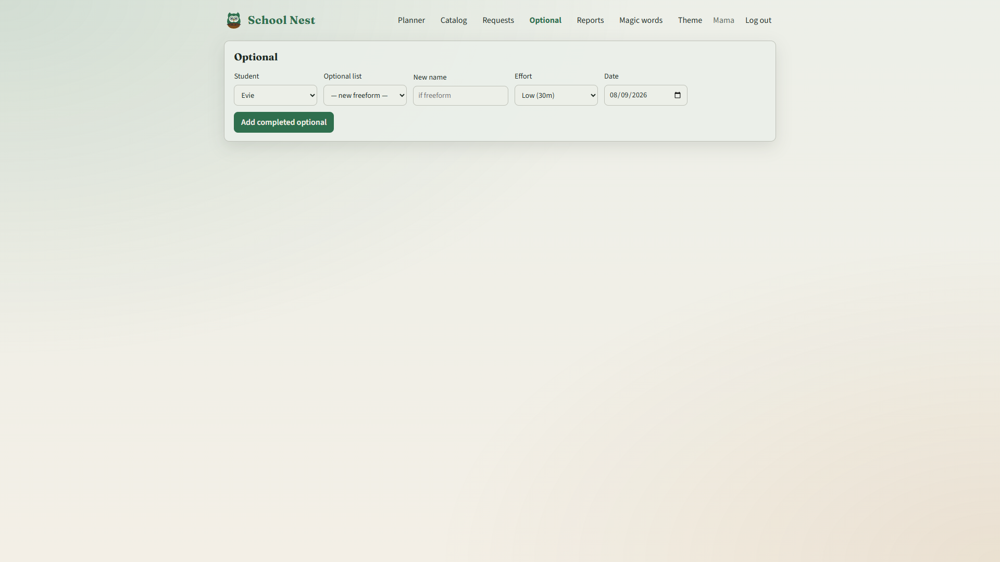
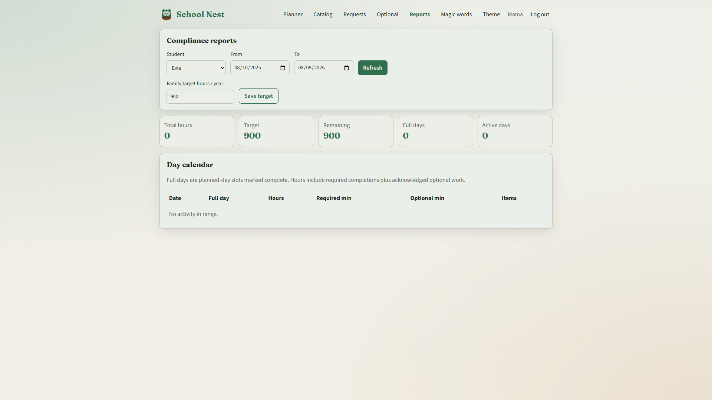
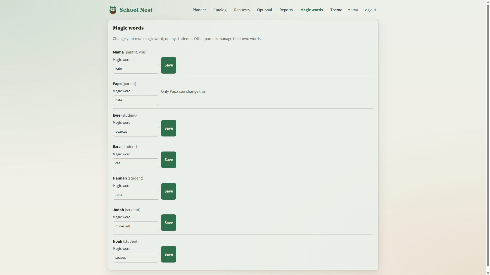
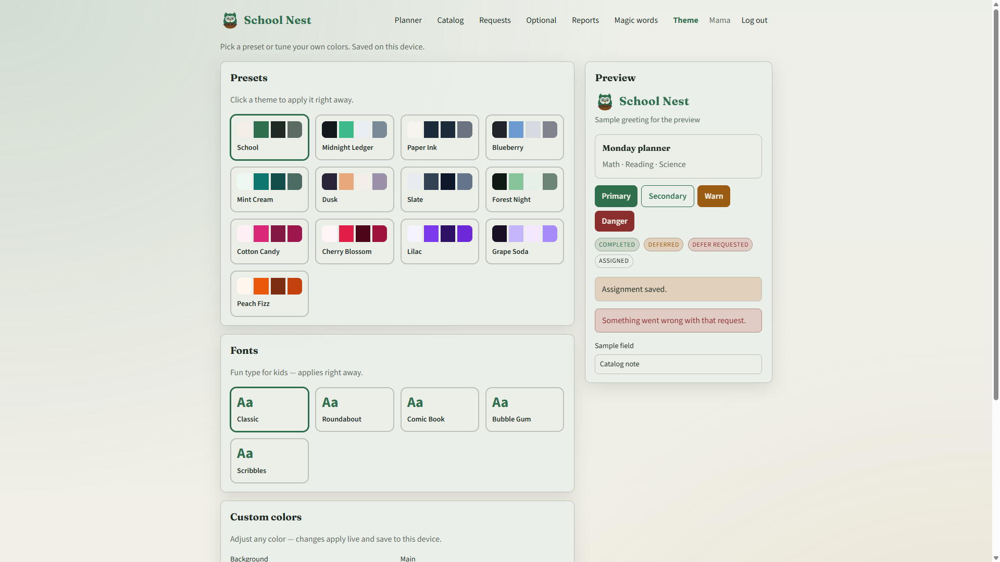
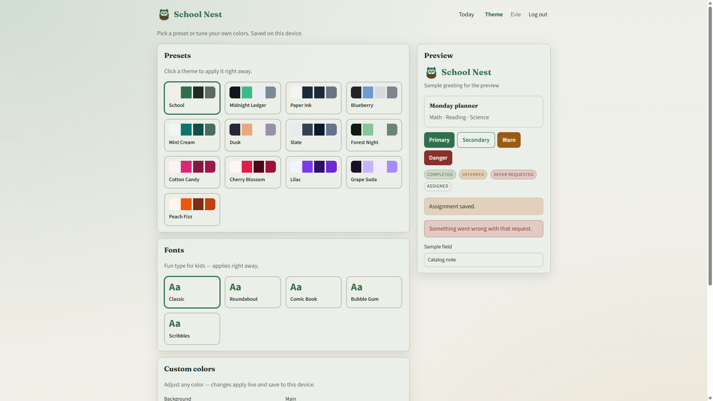
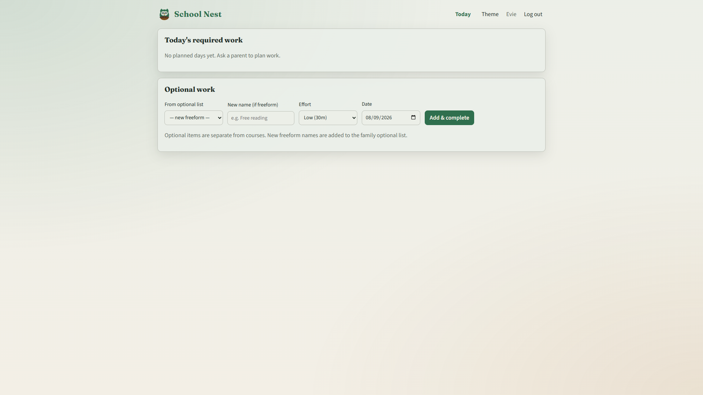

# School Nest — Feature audit walkthrough

School Nest is a self-hosted homeschool tracker: parents build a catalog and ordered day slots; students complete or defer work and log optional hours; parents approve requests and track compliance hours.

Screenshots in this folder were captured from a live local run. At capture time the catalog had content but **no planned days** for Evie, so Planner / Today / Requests show empty states.

| File | Page |
|------|------|
| `01-login.png` | Login |
| `02-planner.png` | Planner (parent) |
| `03-catalog.png` | Catalog (parent) |
| `04-requests.png` | Requests (parent) |
| `05-optional.png` | Optional (parent) |
| `06-reports.png` | Reports (parent) |
| `07-magic-words.png` | Magic words (parent) |
| `08-theme.png` | Theme (parent nav) |
| `09-today-student.png` | Today (student) |
| `10-theme-student-nav.png` | Theme (student nav) |

---

## Roles & navigation

| Role | Landing | Nav |
|------|---------|-----|
| Parent | `/planner.html` | Planner, Catalog, Requests, Optional, Reports, Magic words, Theme |
| Student | `/index.html` | Today, Theme |

Auth is profile pick + magic word. `/deferrals.html` redirects to `/requests.html`.

---

## Cross-cutting concepts

- **Effort:** Low = 30m, High = 60m. Set on assign; students can change on complete; parents can override anytime.
- **Planned days:** Ordered slots (not calendar-first). A day completes when all required work is done.
- **Optional work:** Separate from subjects/courses. Hours count only after parent acknowledgment on Requests.
- **Deferral:** Student requests → parent approves (slides course forward) or rejects.

---

## End-to-end workflows

1. **Curriculum setup (parent):** Catalog → add Subject → Course → catalog assignment (name, URL, default effort, description).
2. **Schedule required work (parent):** Planner → pick student → Add planned day → Assign from catalog (MVP: one required assignment per course per day).
3. **Do school (student):** Today → Complete (with effort) or Request deferral; optionally log freeform/list optional → Add & complete.
4. **Parent inbox:** Requests → approve/reject deferrals; acknowledge optional hours (optionally adjust effort first).
5. **Parent logs optional for a kid:** Optional → student + activity + effort + date → Add completed optional → still needs Requests ack for hours.
6. **Compliance:** Reports → date range + student → hours vs family yearly target; day calendar of full/active days.
7. **Access:** Magic words — parent can change own + all students; cannot change other parents’ words.
8. **Look & feel:** Theme — presets/fonts/custom colors, device-local.

---

## Pages

### 1. Login — `/login.html`

**Purpose:** Shared family gate; pick person, enter magic word.

**Workflow:** Choose profile → magic word → Enter. Parents → Planner; students → Today. Already logged in redirects by role.

---

### 2. Planner (parent) — `/planner.html`

**Purpose:** Build each student’s ordered day slots and attach required catalog work.

**Workflow:** Select student → Add planned day → Assign day + catalog item + effort. Per assignment: Set effort / Remove (if day not completed). Empty until days exist.

---

### 3. Catalog (parent) — `/catalog.html`

**Purpose:** Family curriculum library (Subject → Course → Assignment templates).

**Workflow:** Browse tree → Add subject / course / assignment. Planner pulls from here; not per-student.

---

### 4. Requests (parent) — `/requests.html`

**Purpose:** Approval inbox (nav badge when count > 0).

**Workflows:**

- **Deferrals:** Approve slide / Reject
- **Optional hours:** Set effort (optional) → Acknowledge hours

---

### 5. Optional (parent) — `/optional.html`

**Purpose:** Parent logs completed optional work for a student.

**Workflow:** Student + list item or freeform name + effort + date → Add completed optional → still needs Requests ack. Freeform names join the family optional list.

---

### 6. Reports (parent) — `/reports.html`

**Purpose:** Compliance vs family yearly hour target.

**Workflow:** Student + from/to → Refresh. Stats: total / target / remaining / full days / active days. Day calendar: date, full day?, hours, required/optional minutes, item count. Save family target hours/year.

---

### 7. Magic words (parent) — `/magic-words.html`

**Purpose:** Manage login passwords for self and students.

**Workflow:** Edit field → Save. Other parents’ words are read-only.

---

### 8. Theme (both) — `/theme.html`

**Purpose:** Device-local appearance (presets, kid fonts, custom colors + live preview).

**Workflow:** Click preset/font or tweak colors; applies immediately, stored on device. Same page; nav differs by role.

---

### 9. Today (student) — `/index.html`

**Purpose:** Student home for the current planned day slot.

**Workflows:**

- Required: Complete (with effort) or Request deferral; after complete, Update effort. Defer pending → “Waiting on parent”.
- Optional: list or freeform + effort + date → Add & complete (hours await parent ack).

Empty state when no planned days: *“Ask a parent to plan work.”*

---

## Audit notes from capture pass

- Catalog is populated (Math, Language, History, Science, Music); **no planned days** in the DB used for screenshots, so student Today and parent Requests are empty.
- Optional list dropdowns showed only “new freeform” (no seeded optional activities).
- Parent Optional and student Today both create optional work that still needs Requests acknowledgment for hour credit.
